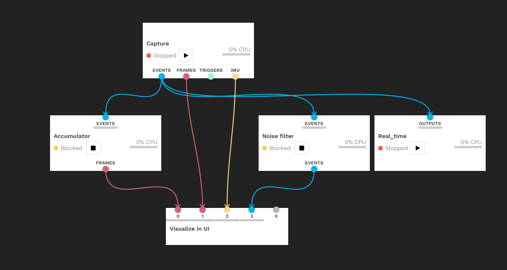
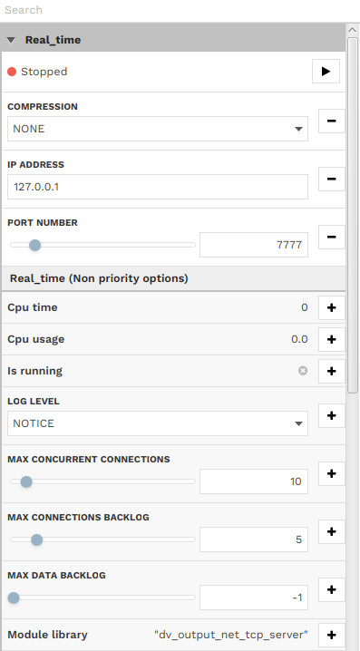

# rpg_e2vid_realtime_ipcamera
Use e2vid models for realtime construction by using an ipcamera
The real-time construction could be used for Davis-346 camera only

Thanks to the authors of [High Speed and High Dynamic Range Video with an Event Camera](https://github.com/uzh-rpg/rpg_e2vid)
```bibtex
@Article{Rebecq19pami,
  author        = {Henri Rebecq and Ren{\'{e}} Ranftl and Vladlen Koltun and Davide Scaramuzza},
  title         = {High Speed and High Dynamic Range Video with an Event Camera},
  journal       = {{IEEE} Trans. Pattern Anal. Mach. Intell. (T-PAMI)},
  url           = {http://rpg.ifi.uzh.ch/docs/TPAMI19_Rebecq.pdf},
  year          = 2019
}
```


```bibtex
@Article{Rebecq19cvpr,
  author        = {Henri Rebecq and Ren{\'{e}} Ranftl and Vladlen Koltun and Davide Scaramuzza},
  title         = {Events-to-Video: Bringing Modern Computer Vision to Event Cameras},
  journal       = {{IEEE} Conf. Comput. Vis. Pattern Recog. (CVPR)},
  year          = 2019
}
```

# How to use
please first clone the code and install dependencies:

- [PyTorch](https://pytorch.org/get-started/locally/) >= 1.0
- [NumPy](https://www.numpy.org/)
- [Pandas](https://pandas.pydata.org/)
- [OpenCV](https://opencv.org/)
- [DV-Python](https://gitlab.com/inivation/dv/dv-python)

## Install with Anaconda

The installation requires [Anaconda3](https://www.anaconda.com/distribution/).
You can create a new Anaconda environment with the required dependencies as follows (make sure to adapt the CUDA toolkit version according to your setup):

```bash
conda create -n E2VID
conda activate E2VID
conda install pytorch torchvision cudatoolkit=10.0 -c pytorch
conda install pandas
conda install -c conda-forge opencv
```
## Install with dv-gui and dv
```bash
sudo add-apt-repository ppa:inivation-ppa/inivation
sudo apt-get update
sudo apt-get install dv-gui
sudo apt-get install dv-runtime-dev
```
## Run model with event data file

- Download the pretrained model:

```bash
wget "http://rpg.ifi.uzh.ch/data/E2VID/models/E2VID_lightweight.pth.tar" -O pretrained/E2VID_lightweight.pth.tar
```

- Download an example file with event data:

```bash
wget "http://rpg.ifi.uzh.ch/data/E2VID/datasets/ECD_IJRR17/dynamic_6dof.zip" -O data/dynamic_6dof.zip
```

Before running the reconstruction, make sure the conda environment is sourced:

```bash
conda activate E2VID
```

- Run reconstruction:

```bash
python run_reconstruction.py \
  -c pretrained/E2VID_lightweight.pth.tar \
  -i data/dynamic_6dof.zip \
  --auto_hdr \
  --display \
  --show_events
```


- Run Realtime with ipcamera

By using the DV-python to input data stream with the ip(127.0.0.1) and port(7777)

**see more on https://gitlab.com/inivation/dv/dv-python**

Put pretrained model in 
```bash
pretrained/E2VID_lightweight.pth.tar 
```

We set the default number of lines 15000. Every lines are composed with [timestamps, x, y, polarities].
You could change it in the run_realtime.py. 

Our settine of DV-python is showed below:




Run the file run_realtime.py and enjoy.
```bash
python run_realtime.py 
```


## Parameters

Below is a description of the most important parameters:

#### Main parameters

- ``--window_size`` / ``-N`` (default: None) Number of events per window. This is the parameter that has the most influence of the image reconstruction quality. If set to None, this number will be automatically computed based on the sensor size, as N = width * height * num_events_per_pixel (see description of that parameter below). Ignored if `--fixed_duration` is set.
- ``--fixed_duration`` (default: False) If True, will use windows of events with a fixed duration (i.e. a fixed output frame rate).
- ``--window_duration`` / ``-T`` (default: 33 ms) Duration of each event window, in milliseconds. The value of this parameter has strong influence on the image reconstruction quality. Its value may need to be adapted to the dynamics of the scene. Ignored if `--fixed_duration` is not set.
- ``--Imin`` (default: 0.0), `--Imax` (default: 1.0): linear tone mapping is performed by normalizing the output image as follows: `I = (I - Imin) / (Imax - Imin)`. If `--auto_hdr` is set to True, `--Imin` and `--Imax` will be automatically computed as the min (resp. max) intensity values.
- ``--auto_hdr`` (default: False) Automatically compute `--Imin` and `--Imax`. Disabled when `--color` is set.
- ``--color`` (default: False): if True, will perform color reconstruction as described in the paper. Only use this with a [color event camera](http://rpg.ifi.uzh.ch/CED.html) such as the Color DAVIS346.

#### Output parameters

- ``--output_folder``: path of the output folder. If not set, the image reconstructions will not be saved to disk.
- ``--dataset_name``: name of the output folder directory (default: 'reconstruction').

#### Display parameters

- ``--display`` (default: False): display the video reconstruction in real-time in an OpenCV window.
- ``--show_events`` (default: False): show the input events side-by-side with the reconstruction. If ``--output_folder`` is set, the previews will also be saved to disk in ``/path/to/output/folder/events``.

#### Additional parameters

- ``--num_events_per_pixel`` (default: 0.35): Parameter used to automatically estimate the window size based on the sensor size. The value of 0.35 was chosen to correspond to ~ 15,000 events on a 240x180 sensor such as the DAVIS240C.
- ``--no-normalize`` (default: False): Disable event tensor normalization: this will improve speed a bit, but might degrade the image quality a bit.
- ``--no-recurrent`` (default: False): Disable the recurrent connection (i.e. do not maintain a state). For experimenting only, the results will be flickering a lot.
- ``--hot_pixels_file`` (default: None): Path to a file specifying the locations of hot pixels (such a file can be obtained with [this tool](https://github.com/cedric-scheerlinck/dvs_tools/tree/master/dvs_hot_pixel_filter) for example). These pixels will be ignored (i.e. zeroed out in the event tensors).


